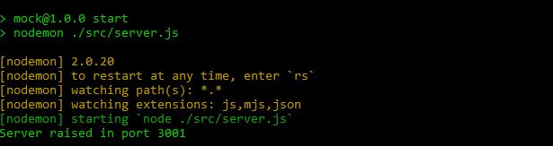

# HW 03: Sequelize part 1 | Integration

## **🕒 Duración estimada**

x minutos

---

<br />

## **📌 INTRO**

En esta homework pondremos en práctica todo lo que hemos aprendido hasta ahora sobre Sequelize. Aplicaremos nuestros conocimientos para conectar nuestro código con una nueva base de datos para nuestro proyecto de Rick & Morty.

---

<br />

## **✅ Pasos básicos para realizar la homework**

Lo primero que debemos hacer es instalar las librerías necesarias para continuar con este proyecto. Para esto, en el **`package.json`** de tu Back-End instala las siguientes librerías:

-  sequelize
-  pg
-  dotenv

Para poder realizar esta homework, lo primero que deberás hacer es crear la base de datos que utilizaremos para nuestro proyecto de Rick & Morty. Para esto abre la terminal **`SQL Shell (psql)`** e ingresa con tu información. Utilizando el comando que ya conoces crea la base de datos que debe tener como nombre: **`rickandmorty`**.

> [**NOTA**]: es muy importante que el nombre de la base de datos sea este y no otro.

Puedes verificar que se haya creado correctamente con el comando:

```SQL
   \l
```

Una vez hecho esto deberás crear un archivo llamado **`.env`**. Este debe encontrarse en la raíz del proyecto, y en su interior tener lo siguiente:

```bash
   DB_USER=postgres
   DB_PASSWORD= ---> ¡Aquí va tu contraseña!
   DB_HOST=localhost
```

---

<br />

<h1 align="center">📋 INSTRUCCIONES</h1>

</br >

## **👩‍💻 EJERCICIO 1**

El primer paso es conectar nuestro código a la base de datos **rickandmorty**. Para esto:

1. Copia y pega el archivo [**DB_connection**](./DB_connection.js) dentro de la carpeta **`src`** de tu proyecto y completa el valor que necesita la instancia de Sequelize. ¡Te dejamos un template en el archivo!

---

</br >

## **👩‍💻 EJERCICIO 2**

Llegó el momento de crear nuestros modelos. Dentro de tu carpeta **`src`** crea una nueva carpeta llamada **`models`**. Dentro de esta carpeta copia y pega el archivo **`Character`**. Aquí deberás crear las siguientes propiedades para el modelo (incluye los tipos):

### **Character**

<details>
   <summary>id</summary>
   <ul>
      <li>Integer</li>
      <li>allowNull: false</li>
      <li>Primary Key</li>
   </ul>
</details>
<details>
   <summary>name</summary>
   <ul>
      <li>String</li>
      <li>allowNull: false</li>
   </ul>
</details>
<details>
   <summary>status</summary>
   <ul>
      <li>Enum (Alive - Dead - unknown)</li>
      <li>allowNull: false</li>
   </ul>
</details>
<details>
   <summary>species</summary>
   <ul>
      <li>String</li>
      <li>allowNull: false</li>
   </ul>
</details>
<details>
   <summary>gender</summary>
   <ul>
      <li>Enum (Female - Male - Genderless - unknown)</li>
      <li>allowNull: false</li>
   </ul>
</details>
<details>
   <summary>origin</summary>
   <ul>
      <li>String</li>
      <li>allowNull: false</li>
   </ul>
</details>
<details>
   <summary>image</summary>
   <ul>
      <li>String</li>
      <li>allowNull: false</li>
   </ul>
</details>

</br >

---

## **👩‍💻 EJERCICIO 3**

Una vez creado el modelo, regresa al archivo **`DB_connection`**. En este ejercicio nos encargaremos de que, cuando levantemos el proyecto, este modelo se guarde en la base de datos. Para esto:

Importa el modelo que haz creado en este archivo. Ahora deberás ejecutar este modelo pasándole como argumento la instancia de Sequelize ya creada. 👀 Revisa 👀 que hay comentado en el archivo un espacio para que realices este ejercicio.

---

</br >

## **😼 BREAK 😼**

En este momento ya deberíamos de poder levantar el proyecto y que todo esté funcionando correctamente. Para esto ejecuta el comando:

```bash
   npm start
```

<div align="center" >
   
</div>

---

<br />

## **👩‍💻 EJERCICIO 4**

¡Ahora si! Llegó el momento de guardar los personajes en nuestra base de datos. Para esto tendremos que crear un controlador y una ruta.

### **Controlador**

Dirígete a la carpeta **`controllers`** y crea un archivo llamado **`saveApiData`**. Dentro de este archivo deberás:

1. Crea una función llamada **`getApiData`**.

2. El objetivo de esta función es hacer un request a la API de Rick & Morty ("**`https://rickandmortyapi.com/api/character`**") y obtener los primeros 100 personajes.

> [**NOTA**]: no olvides de manejar el error.

3. Cada personaje viene con información que no nos interesa, por lo que es importante que todos los personajes de tu array solo tengan las propiedades:

-  Id
-  Name
-  Species
-  Status
-  Origin
-  Gender
-  Image

4. Finalmente, esta función debe retornar el arreglo con los primeros 100 personajes.

> [**PISTA**]: ¡hay muchas formas de resolver esto! Te desafíamos a que utilices recursión, pero puedes hacerlo como más prefieras.

---

</br >

## **👩‍💻 EJERCICIO 5**

Una vez que tu función cumpla con su objetivo tendremos que guardar a los personajes en la base de datos. En el mismo archivo de antes crea una función llamada **`saveApiData`** y expórtala.

1. Ejecuta a la función **`getApiData`** y guarda la información que retorna dentro de una variable.

2. Importa en este archivo a tu modelo de la siguiente forma:

```javascript
const { character } = require('../models/Character');
```

3. Esta función debe guardar cada uno de los personajes en la base de datos. Puedes utilizar la query **`findOrCreate`**.

---

<br />

## **👩‍💻 EJERCICIO 6**

Ve al archivo **`server`**. Aquí deberás importar la función creada en el ejercicio anterior, y el objeto **`sequelize`** del archivo **`DB_connection`**.

1. Sincroniza la base de datos, pasándole como argumento la propiedad **force** en true.

2. Ejecuta la función **`saveApiData`**.

3. Luego de los dos pasos anteriores debe levantarse el servidor.

---

<br />

## **👩‍💻 EJERCICIO 7**

Para validar que todo salió correctamente vamos a crear nuestra primera ruta GET, y obtener a todos nuestros personajes. Para esto:

1. Dirígete a la carpeta **`controllers`** y crea un nuevo controlador llamado **`getAllChars`** que se encargue de buscar todos los personajes guardados en la base de datos.

> [**NOTA**]: puedes utilizar la query: findAll.

2. Crea la route en el archivo **`index`** de tu carpeta **routes**. El path de esta ruta debe ser: "_/rickandmorty/all_".

Una vez que hayas construido esta función puede compobar en tu iterador de APIs favorita (thunder, postman, insomnia, etc...) que esta ruta funcione correctamente. El endponit al que tienes que apuntar el request es:

```javascript
'http://localhost:3001/rickandmorty/allCharacters';
```

---

<br />

## **🔎 Recursos adicionales**

-  Documentación [**API Rick and Morty**](https://rickandmortyapi.com/documentation/#get-all-characters)

-  Documentación [**Sequelize**](https://sequelize.org/docs/v6/)

<div align="center">
   
</div>
