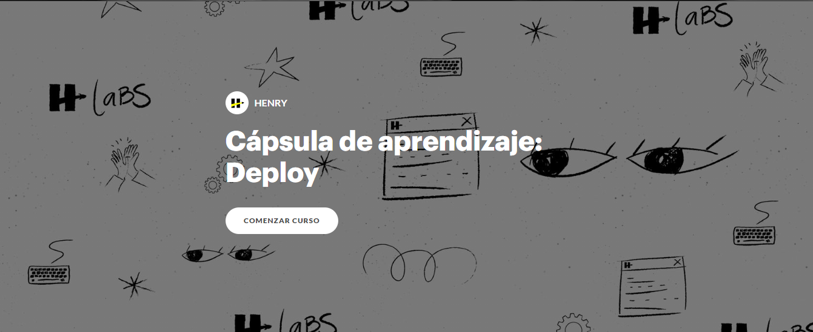

# HW 03: Sequelize part 2 | Integration

## **🕒 Duración estimada**

x minutos

---

<br />

## **📌 INTRO**

En esta homework nos encargaremos de terminar de integrar una base de datos en nuestro proyecto de Rick and Morty.

---

<br />

<h1 align="center">📋 INSTRUCCIONES</h1>

</br >

## **👩‍💻 EJERCICIO 1**

### **MODELO - FAVS**

1. Dentro de tu carpeta **models** crea un nuevo modelo llamado **`Favorite`**. Este modelo debe tener las mismas propiedades que el modelo **Character**.

2. Importa este nuevo modelo dentro de tu archivo **`DB_connection`** y ejectútalo pasándole como argumento la instancia de Sequelize ya creada.

</br>

---

## **👩‍💻 EJERCICIO 2**

### **POST /FAV**

Ahora si conectaremos esta ruta con nuestra base de datos. Para esto, elimina la carpeta **utils** junto con todo lo que tenga dentro.

1. Ve a tu controlador **`postFav`**.

2. Elimina la importación que ya no es necesario, e importa tu nuevo modelo dentro de este archivo:

```javascript
const { favorite } = require('../DB_connection');
```

3. Este controlador debe guardar en esta tabla el personaje que llega por **`req.body`**.

---

</br >

## **👩‍💻 EJERCICIO 3**

Ahora ve a tu controlador **`getChatById`**. Aquí deberás:

1. Elimina la importación que ya no es necesario, e importa tu nuevo modelo dentro de este archivo:

```javascript
const { favorite } = require('../DB_connection');
```

2. Este controlador debe obtener todos los personajes de la tabla de favoritos y devolverlos.

</br >

---

## **👩‍💻 EJERCICIO 4**

Por último, ve a tu controlador **`getChatDetail`**. Aquí deberás:

1. Elimina la importación que ya no es necesario, e importa tu nuevo modelo dentro de este archivo:

```javascript
const { favorite } = require('../DB_connection');
```

2. Este controlador debe eliminar al personaje de la base de datos que tenga el mismo ID que recibes por parámetro.

> [**NOTA**]: puedes utilizar el query: destroy.

---

</br >

<div>

😁 ¡FELICITACIONES! 😁 Has finalizado la última homework de el último módulo.

😏No alegra que haya podido completar este proyecto. ¡Ahora te invitamos a que lo deployes! Para esto te compartimos nuestra cápsula de deploy...

<div align="center">
   <a href="https://rise.articulate.com/share/YKtorcVy0_ch_T7ETfudX4olPcYcXE6o#/">
      
   </a>
</div>
